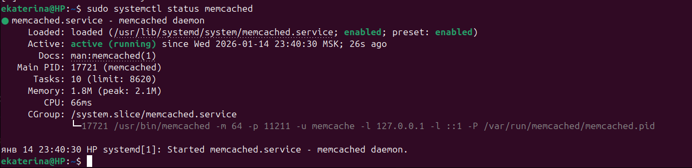
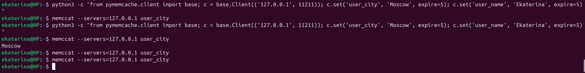
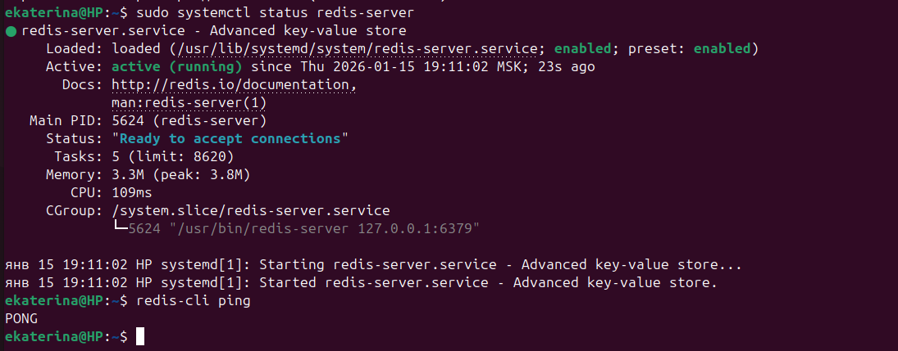
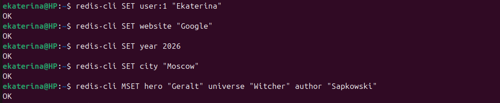
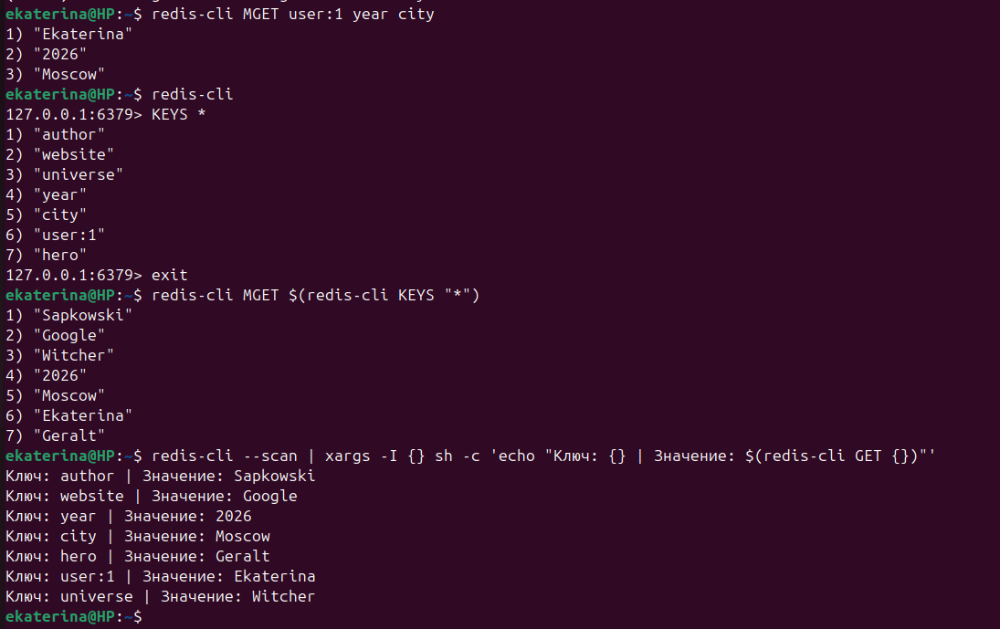

# Домашнее задание к занятию "`Кеширование Redis/memcached`" - `Минаевой Екатерины`

### Задание 1. Кеширование

*Приведите примеры проблем, которые может решить кеширование.*

Кэширование решает задачи по оптимизации производительности, снижению нагрузки на инфраструктуру и улучшению пользовательского опыта. Ниже приведены основные проблемы и способы их решения:

1. Высокая нагрузка на основную базу данных.
* Проблема: При большом количестве пользователей база данных перестает справляться с потоком запросов на чтение. Это приводит к росту очередей, блокировкам таблиц и отказам в обслуживании.
* Решение: Повторяющиеся запросы сохраняются в кэше.
* Результат: Большая часть запросов на чтение обрабатывается в оперативной памяти, не доходя до дисковой подсистемы БД.

2. Медленные и тяжелые вычисления.
* Проблема: Некоторые данные требуют длительной обработки перед выдачей пользователю.
* Решение: Результат выполнения сложной функции сохраняется в кэше по ключу, сформированному из входных параметров.
* Результат: Вместо генерации отчета система выдает готовый результат за несколько миллисекунд.

3. Проблема наплыва запросов при инвалидации.
* Проблема: Когда срок жизни (TTL) популярного ключа в кэше истекает, тысячи одновременных запросов «проваливаются» в основную базу данных одновременно, что может вызвать её падение.
* Решение: Redis позволяет использовать механизмы блокировок (Distributed Locks) или «мягкое» обновление кэша (пока один процесс обновляет данные, остальные получают старую версию из кэша).
* Результат: Стабильная работа системы даже в моменты обновления критически важных данных.

4. Хранение сессий пользователей.
* Проблема: В распределенных системах сессия пользователя, сохраненная в файлах одного сервера, будет недоступна на другом. Хранение сессий в классической БД слишком медленно.
* Решение: Использование Redis как централизованного и сверхбыстрого хранилища сессий.
* Результат: Пользователь остается авторизованным при переключении между серверами, а проверка прав доступа происходит мгновенно.

5. Ограничение частоты запросов.
* Проблема: Веб-ресурсы часто подвергаются атакам перебора паролей (brute force) или парсингу контента ботами, что перегружает API.
* Решение: Redis предоставляет атомарные счетчики и структуры (например, Sorted Sets), которые позволяют отслеживать количество запросов с одного IP в реальном времени.
* Результат: Система может мгновенно заблокировать подозрительную активность, не нагружая при этом основную логику приложения.

6. Снижение сетевых задержек.
* Проблема: Физическое чтение данных с диска всегда медленнее, чем чтение из оперативной памяти. В высоконагруженных системах задержка в 100–200 мс на запрос критична.
* Решение: Memcached и Redis работают исключительно с RAM, обеспечивая субмиллисекундное время отклика.
* Результат: Веб-страницы загружаются быстрее, что напрямую влияет на конверсию и позиции в поисковых системах.

Краткое сравнение инструментов:
* Memcached: Лучше всего подходит для простых задач кэширования небольших объектов (строки, JSON), где важна максимальная простота и скорость «вставил-забрал».
* Redis: Решает более сложные задачи благодаря поддержке структур данных (списки, хэши, множества), возможности сохранения данных на диск и встроенным механизмам публикации/подписки (Pub/Sub).

---

### Задание 2. Memcached

*Установите и запустите memcached.*
*Приведите скриншот systemctl status memcached, где будет видно, что memcached запущен.*

---

### Задание 3. Удаление по TTL в Memcached

*Запишите в memcached несколько ключей с любыми именами и значениями, для которых выставлен TTL 5.*
*Приведите скриншот, на котором видно, что спустя 5 секунд ключи удалились из базы.*

---

### Задание 4. Запись данных в Redis

*Запишите в Redis несколько ключей с любыми именами и значениями.*
*Через redis-cli достаньте все записанные ключи и значения из базы, приведите скриншот этой операции.*

---