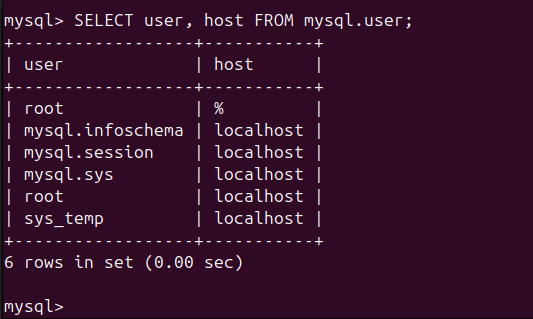
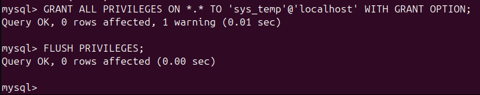
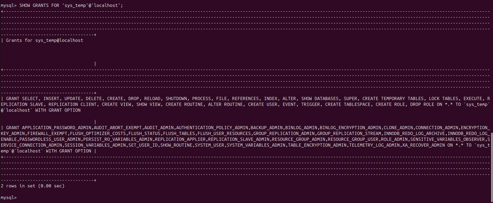
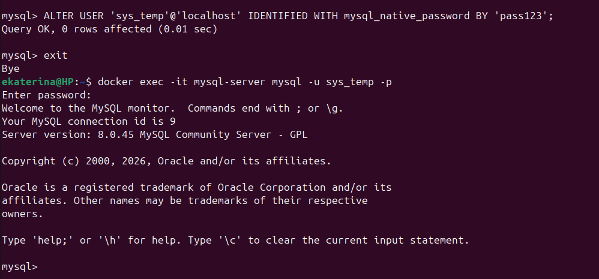
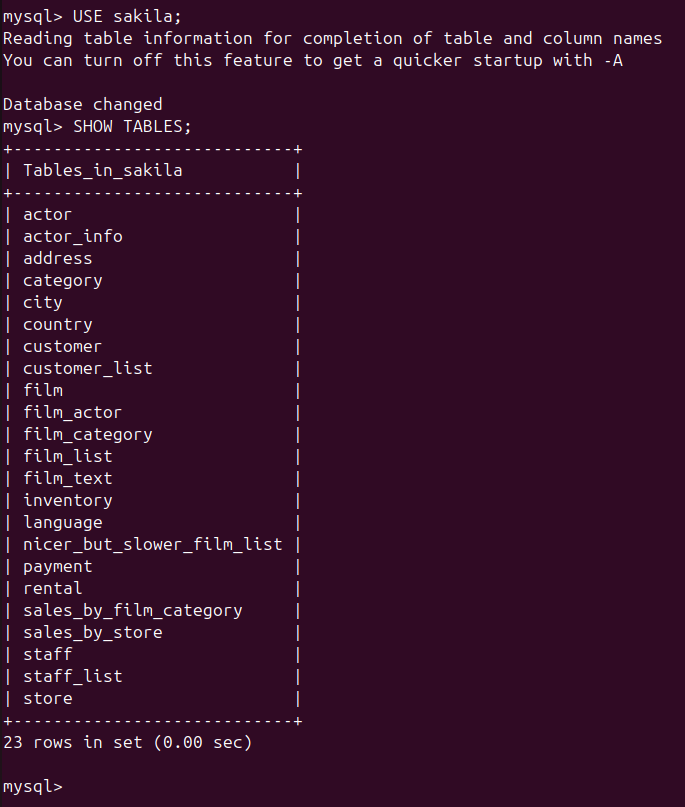

# Домашнее задание к занятию "`Работа с данными (DDL/DML)`" - `Минаевой Екатерины`

### Задание 1.

1.1. Поднимите чистый инстанс MySQL версии 8.0+. Можно использовать локальный сервер или контейнер Docker. <br>
1.2. Создайте учётную запись sys_temp. <br>
1.3. Выполните запрос на получение списка пользователей в базе данных. (скриншот) <br>
1.4. Дайте все права для пользователя sys_temp. <br>
1.5. Выполните запрос на получение списка прав для пользователя sys_temp. (скриншот) <br>
1.6. Переподключитесь к базе данных от имени sys_temp. <br>
Для смены типа аутентификации с sha2 используйте запрос: <br>
`ALTER USER 'sys_test'@'localhost' IDENTIFIED WITH mysql_native_password BY 'password';` <br>
1.6. По ссылке https://downloads.mysql.com/docs/sakila-db.zip скачайте дамп базы данных. <br>
1.7. Восстановите дамп в базу данных. <br>
1.8. При работе в IDE сформируйте ER-диаграмму получившейся базы данных. При работе в командной строке используйте команду для получения всех таблиц базы данных. (скриншот) <br>

*Результатом работы должны быть скриншоты обозначенных заданий, а также простыня со всеми запросами.*


### Решение 1.

 <br>

 <br>

 <br>

 <br>

 <br>


Запросы:

```
docker run --name mysql-server -e MYSQL_ROOT_PASSWORD=pass123 -d -p 3306:3306 mysql:8.0
docker ps
docker exec -it mysql-server mysql -u root -p
mysql> CREATE USER 'sys_temp'@'localhost' IDENTIFIED BY 'pass123';
mysql> SELECT user, host FROM mysql.user;
mysql> GRANT ALL PRIVILEGES ON *.* TO 'sys_temp'@'localhost' WITH GRANT OPTION;
mysql> FLUSH PRIVILEGES;
mysql> SHOW GRANTS FOR 'sys_temp'@'localhost';
mysql> ALTER USER 'sys_temp'@'localhost' IDENTIFIED WITH mysql_native_password BY 'pass123';
mysql> exit
docker exec -it mysql-server mysql -u sys_temp -p
mysql> exit
unzip /home/ekaterina/Загрузки/sakila-db.zip -d /home/ekaterina/Загрузки/sakila_extracted
docker cp /home/ekaterina/Загрузки/sakila_extracted/sakila-db/sakila-schema.sql mysql-server:/tmp/
docker cp /home/ekaterina/Загрузки/sakila_extracted/sakila-db/sakila-data.sql mysql-server:/tmp/
docker exec -it mysql-server mysql -u sys_temp -p -e "CREATE DATABASE sakila;"
docker exec -i mysql-server mysql -u sys_temp -ppass123 sakila < /home/ekaterina/Загрузки/sakila_extracted/sakila-db/sakila-schema.sql
docker exec -i mysql-server mysql -u sys_temp -ppass123 sakila < /home/ekaterina/Загрузки/sakila_extracted/sakila-db/sakila-data.sql
docker exec -it mysql-server mysql -u sys_temp -p
mysql> USE sakila;
mysql> SHOW TABLES;
mysql> exit
docker ps
docker stop dea056e2c509
docker ps
```


---

### Задание 2.

Составьте таблицу, используя любой текстовый редактор или Excel, в которой должно быть два столбца: в первом должны быть названия таблиц восстановленной базы, во втором названия первичных ключей этих таблиц. <br> 
Пример: (скриншот/текст) <br>

| Название таблицы | Название первичного ключа |
| ---------------- | ------------------------- |
| customer         | customer_id               |


### Решение 2.


| Название таблицы              | Название первичного ключа                  |
| ----------------------------- | ------------------------------------------ | 
| actor                         | actor_id                                   |
| actor_in                      | actor_id, film_id                          | 
| address                       | address_id                                 | 
| category                      | category_id                                | 
| city                          | city_id                                    |
| country                       | country_id                                 | 
| customer                      | customer_id                                | 
| customer_list                 | нет ПК, но уникальным полем является ID    | 
| film                          | film_id                                    | 
| film_actor                    | actor_id, film_id (составной ключ)         | 
| film_category                 | film_id, category_id (составной ключ)      | 
| film_list                     | это VIEW, уникальным полем является FID    | 
| film_text                     | film_id                                    | 
| inventory                     | inventory_id                               | 
| language                      | language_id                                | 
| nicer_but_slower_film_list    | это VIEW, уникальным полем является FID    | 
| payment                       | payment_id                                 | 
| rental                        | rental_id                                  | 
| sales_by_film_category        | нет ПК                                     | 
| sales_by_store                | нет ПК                                     | 
| staff                         | staff_id                                   | 
| staff_list                    | нет ПК, но уникальным полем является ID    | 
| store                         | store_id                                   | 


---
