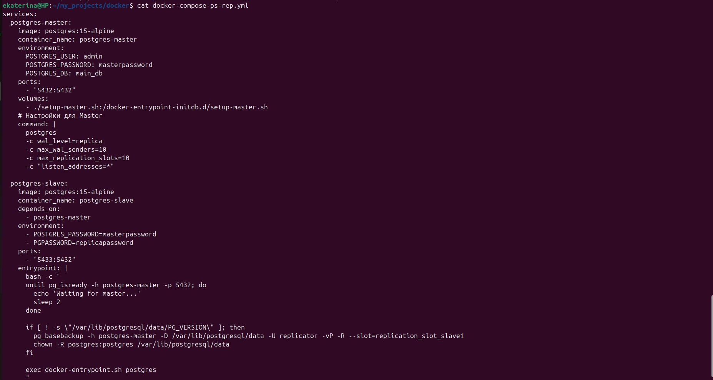
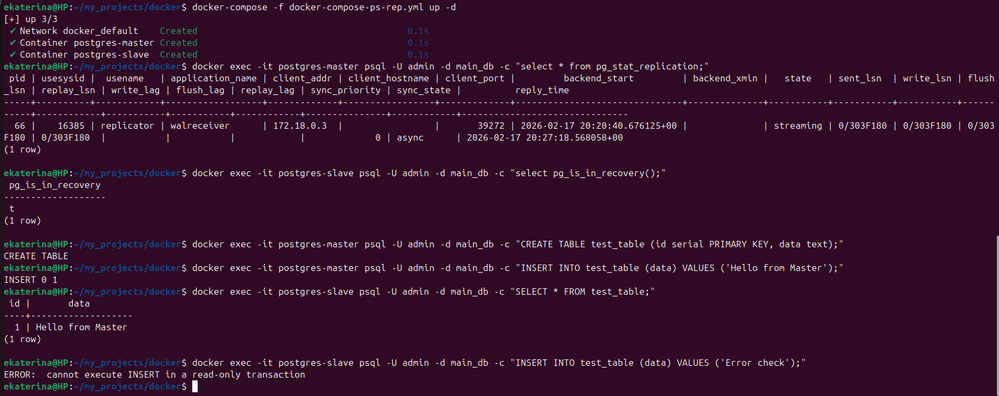

# Домашнее задание к занятию "`Репликация и масштабирование. Часть 1`" - `Минаевой Екатерины`

### Задание 1.

На лекции рассматривались режимы репликации master-slave, master-master, опишите их различия.  

### Решение 1.

Основные отличия между этими режимами заключаются в распределении полномочий на запись данных и сложности поддержания их целостности.
1. Master-Slave (Основной-Реплика).  
В этой схеме роли жестко разделены: один сервер (Master) принимает все изменения (INSERT, UPDATE, DELETE), а остальные (Slaves) только читают данные.  
Как это работает: Master записывает изменения в бинарный лог, а Slaves копируют эти записи и воспроизводят их у себя.  
Плюсы:
* Простота: Легко настроить, нет конфликтов при записи.
* Масштабируемость чтения: Можно добавить десятки Slaves для обработки тяжелых SELECT-запросов.
* Безопасность: Реплики могут служить «живым» бэкапом.
Минусы:
* Узкое место на запись: Все изменения идут через один узел; если Master перегружен, система тормозит.
* Ручное переключение (Failover): Если Master упадет, нужно вручную (или через доп. софт) назначать нового «главного», что чревато простоем.
* Лаг репликации: Данные на Slaves появляются с небольшой задержкой (eventual consistency). 
  

2. Master-Master (Multi-Master).  
Здесь два или более серверов равноправны: любой из них может принимать и чтение, и запись.  
Как это работает: Изменения на одном мастере зеркально отображаются на другом. Это создает «кольцевую» или двунаправленную связь.  
Плюсы:
* Отказоустойчивость (High Availability): Если один мастер выйдет из строя, приложение мгновенно переключится на второй без остановки записи.
* Распределение записи: Позволяет частично разгрузить запись, особенно в географически распределенных системах.
Минусы:
* Конфликты данных: Если два мастера одновременно изменят одну и ту же строку, возникнет конфликт, который БД сама может не разрешить.
* Сложность: Требует тщательной настройки автоинкрементов (например, нечетные ID на одном, четные на другом) и мониторинга.
* Слабая согласованность: Из-за асинхронности узлы могут на короткое время иметь разные данные. 

Сводная таблица отличий:  

| Характеристика     | Master-Slave                    | Header 3                     |
| ------------------ | ------------------------------- | ---------------------------- |
| Запись             | Только на один узел (Master)    | На любой узел (оба Master)   |
| Конфликты          | Отсутствуют по определению      | Вероятны и сложны в решении  |
| Отказоустойчивость | Требует времени на переключение | Почти мгновенная             |
| Масштабирование    | Идеально для чтения             | Помогает распределить запись |

  
Master-Slave можно использовать для большинства проектов, в которых чтений в разы больше, чем записей.  
Master-Master обычно используется в сучае, когда критически важна доступность на запись 24/7. Также важно учитывать момент с настройкой сложной логики разрешения конфликтов.  

---

### Задание 2.

Выполните конфигурацию master-slave репликации, примером можно пользоваться из лекции.  
Приложите скриншоты конфигурации, выполнения работы: состояния и режимы работы серверов.

### Решение 2.

  

  

  

---
