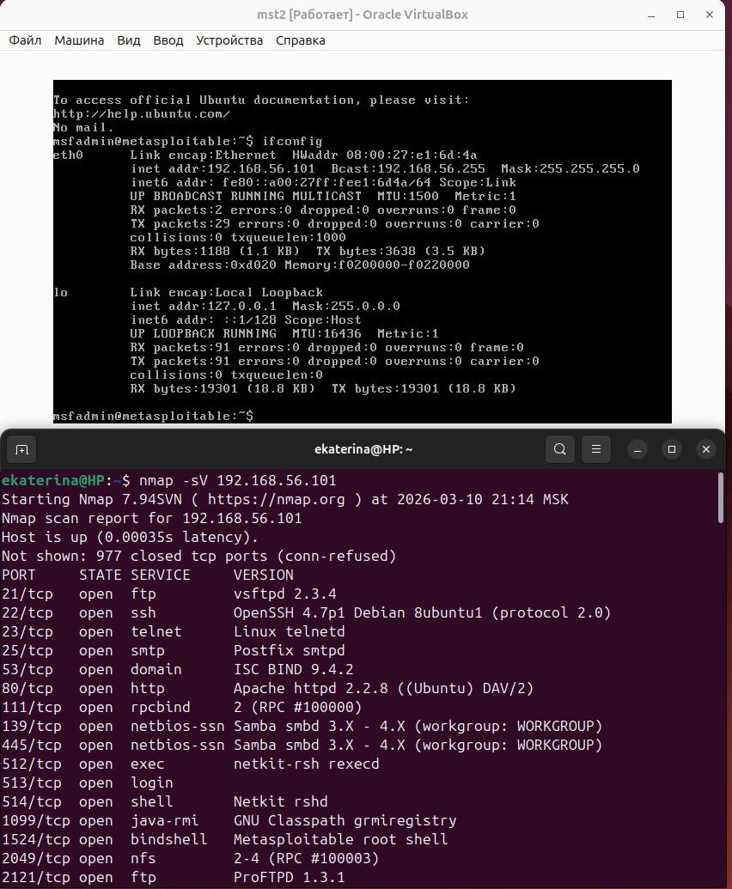
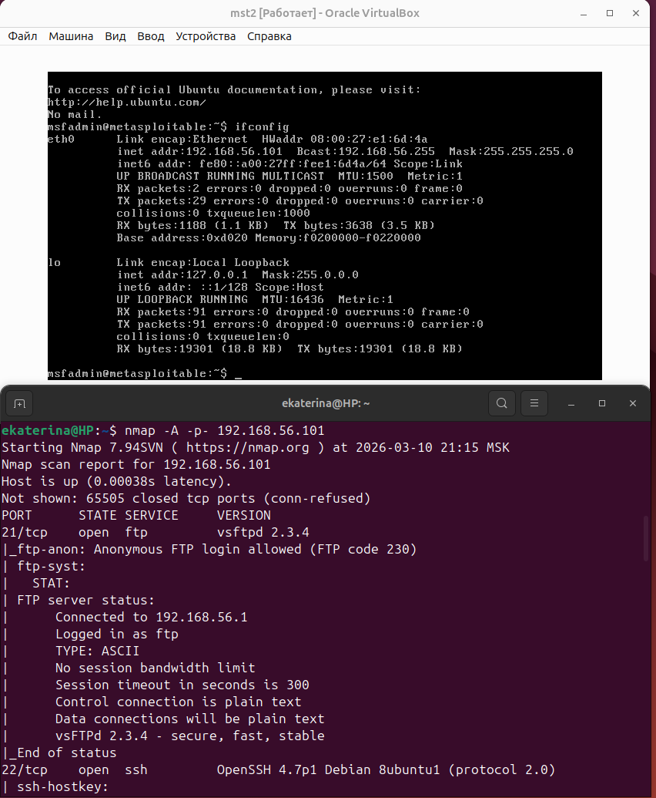
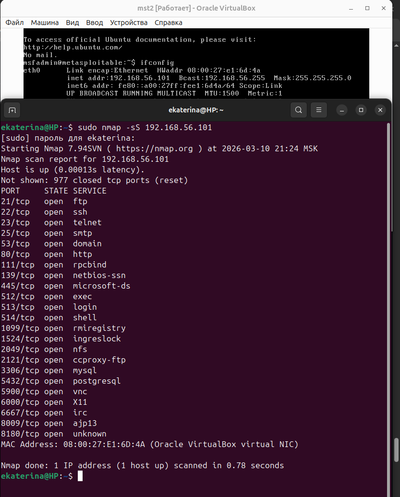
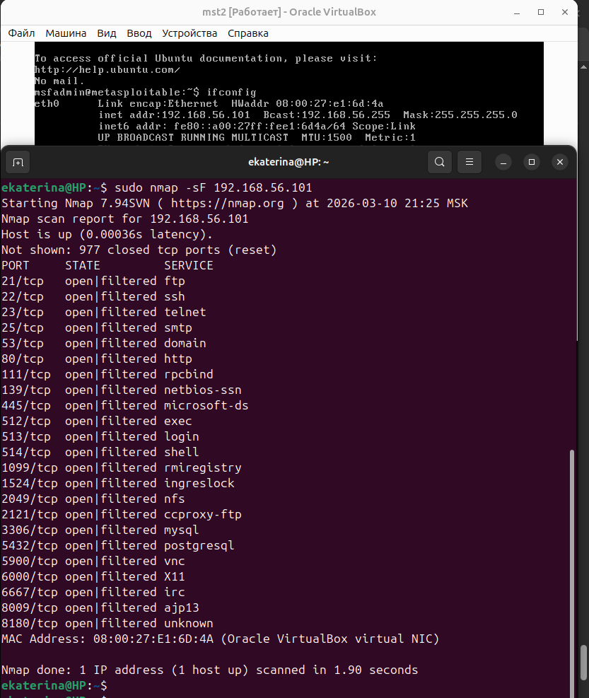
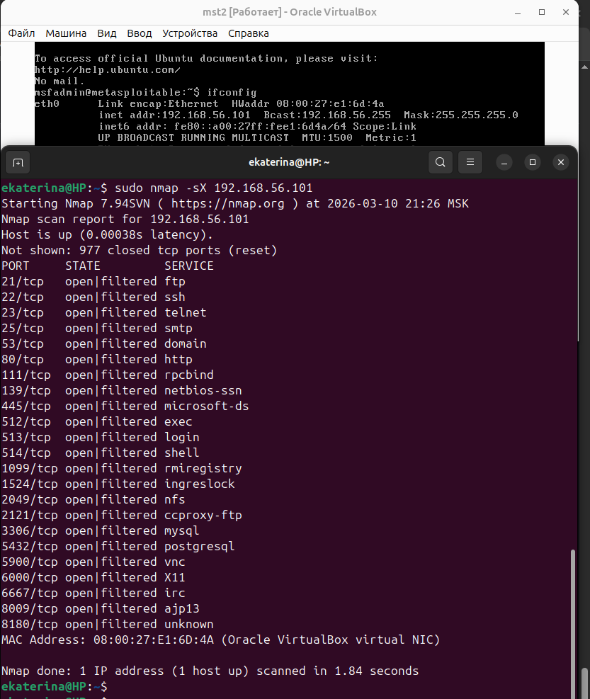
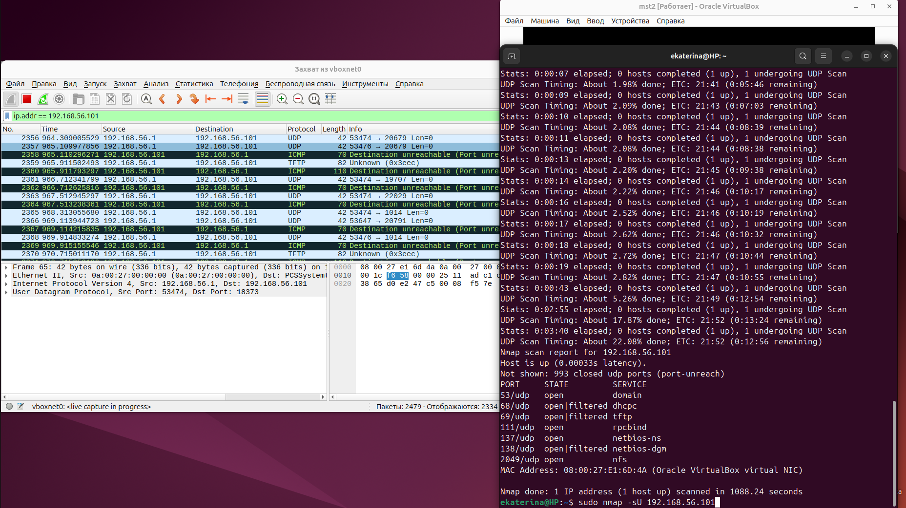

# Домашнее задание к занятию "`Уязвимости и атаки на информационные системы`" - `Минаевой Екатерины`

### Задание 1.

Скачайте и установите виртуальную машину Metasploitable: https://sourceforge.net/projects/metasploitable/.  
Это типовая ОС для экспериментов в области информационной безопасности, с которой следует начать при анализе уязвимостей.  
Просканируйте эту виртуальную машину, используя nmap.  
Попробуйте найти уязвимости, которым подвержена эта виртуальная машина.  
Сами уязвимости можно поискать на сайте https://www.exploit-db.com/.   
Для этого нужно в поиске ввести название сетевой службы, обнаруженной на атакуемой машине, и выбрать подходящие по версии уязвимости.  
Ответьте на следующие вопросы:
- Какие сетевые службы в ней разрешены?
- Какие уязвимости были вами обнаружены? (список со ссылками: достаточно трёх уязвимостей)  
*Приведите ответ в свободной форме.*

### Решение 1.

  

  

Metasploitable намеренно содержит множество открытых портов (более 20). Основные из них: 
* FTP (порт 21) — служба передачи файлов.
* SSH (порт 22) — удаленный доступ.
* Telnet (порт 23) — небезопасный удаленный доступ.
* HTTP (порт 80) — веб-сервер Apache.
* Samba (порты 139, 445) — общие папки Windows.
* MySQL/PostgreSQL (3306, 5432) — базы данных.
* IRC (6667) — чат-сервер.

Ниже приведены три критические уязвимости с ссылками на Exploit-DB:
1. vsftpd 2.3.4 Backdoor Command Execution
* Описание: В этой версии FTP-сервера оставлен «бэкдор», который открывает командную оболочку с правами root при вводе логина, заканчивающегося на `:)` .
* Ссылка: Exploit-DB (EDB-ID: 17491)
2. UnrealIRCd 3.2.8.1 Backdoor Command Execution
* Описание: Популярный IRC-сервер содержит вредоносный код, позволяющий удаленно выполнять любые системные команды.
* Ссылка: Exploit-DB (EDB-ID: 16922)
3. Samba 3.0.20 "Username map script" Execution
* Описание: Ошибка в обработке имен пользователей в Samba позволяет выполнить произвольный код на сервере через специально сформированное имя пользователя.
* Ссылка: Exploit-DB (EDB-ID: 16320)

---

### Задание 2.

Проведите сканирование Metasploitable в режимах SYN, FIN, Xmas, UDP.  
Запишите сеансы сканирования в Wireshark.  
Ответьте на следующие вопросы:
- Чем отличаются эти режимы сканирования с точки зрения сетевого трафика?
- Как отвечает сервер?  
*Приведите ответ в свободной форме.*

### Решение 2.

  

  

  

  

Разница между этими режимами кроется в том, как Nmap «играет» с флагами TCP-пакета и как операционная система (в данном случае Linux на Metasploitable) реагирует на нестандартные запросы.  
Как это выглядит в трафике Wireshark:
1. SYN-сканирование. Это «вежливое», но недосказанное приветствие.
* Трафик: Компьютер посылает пакет с флагом SYN (хочу соединиться).
* Ответ сервера:
    * Если порт открыт: Сервер отвечает SYN-ACK (готов). Ваш компьютер тут же обрывает связь пакетом RST (сброс), не завершая соединение. Это делает сканирование быстрым и менее заметным для логов приложений.
    * Если порт закрыт: Сервер отвечает RST-ACK.
2. FIN-сканирование. Попытка «завершить» соединение, которое даже не начиналось.
* Трафик: Посылается пакет только с флагом FIN. По стандартам RFC, если порт открыт, сервер должен просто проигнорировать такой странный пакет.
* Ответ сервера:
    * Если порт открыт: Тишина (нет ответа).
    * Если порт закрыт: Сервер отвечает RST-ACK.
    * Важно! Это сканирование эффективно против систем на базе Unix/Linux, но бесполезно против Windows (она всегда отвечает RST).
3. Xmas-сканирование. Названо так, потому что пакет «горит всеми огнями» (включены флаги FIN, PSH, URG).
* Трафик: Пакет с тремя включенными флагами. Это некорректное состояние протокола.
* Ответ сервера:
    * Если порт открыт: Тишина (сервер отбрасывает пакет).
    * Если порт закрыт: Сервер отвечает RST-ACK.
    * Для чего это: Помогает обнаружить «дыры» в старых фаерволах, которые пропускают такие странные пакеты.
4. UDP-сканирование. Самое сложное, так как протокол UDP не подразумевает подтверждения доставки (как SYN-ACK в TCP).
* Трафик: Пустой UDP-пакет на конкретный порт.
* Ответ сервера:
    * Если порт открыт: Либо тишина, либо ответ от конкретной службы (например, DNS-ответ).
    * Если порт закрыт: Сервер (точнее, протокол ICMP) присылает ошибку ICMP Port Unreachable (порт недоступен).
    * Проблема: Это сканирование идет долго, так как ОС часто ограничивает скорость отправки ICMP-сообщений об ошибках.

---
