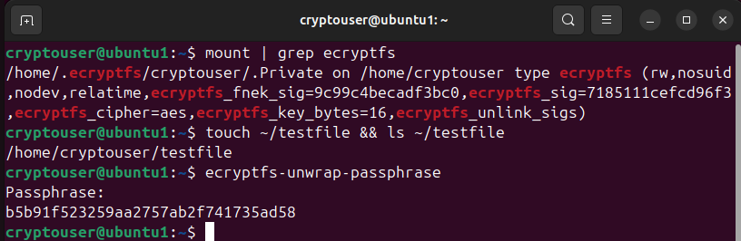
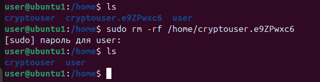
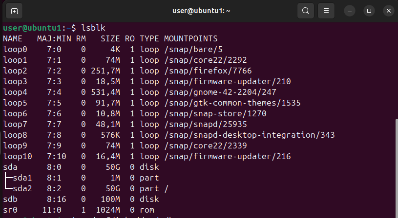
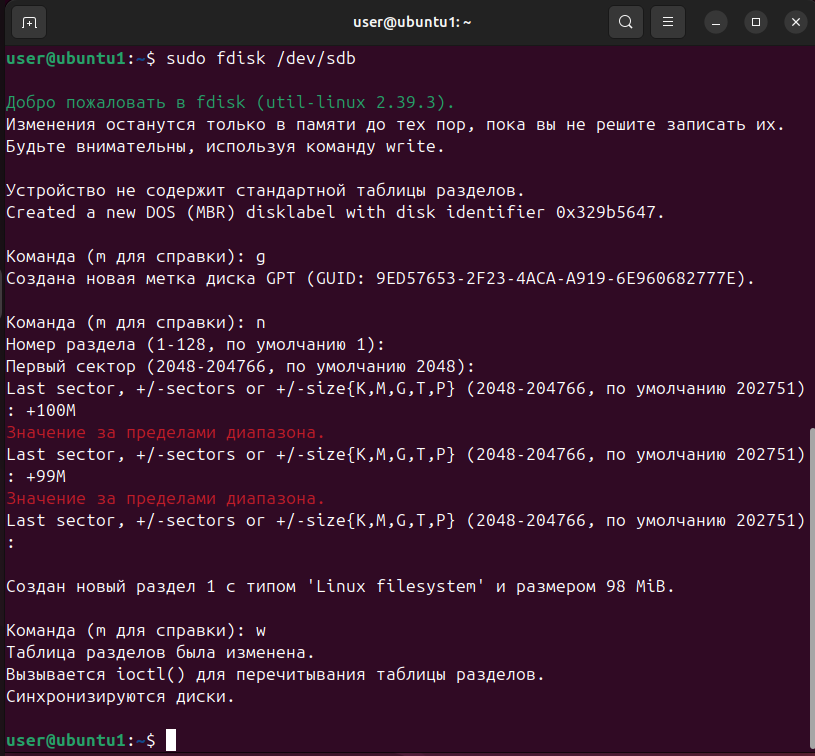
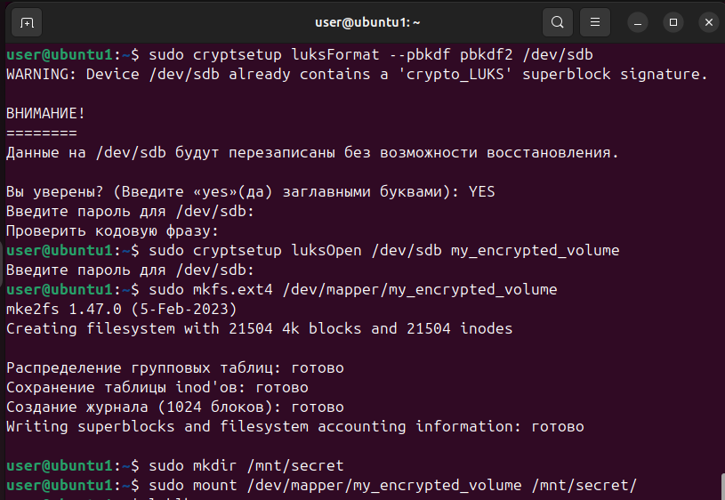
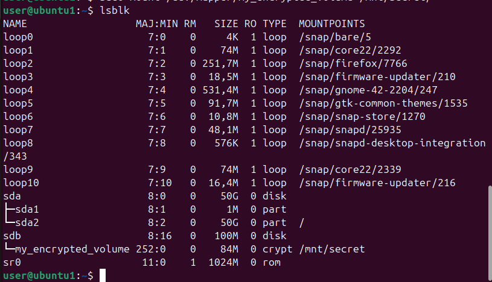

# Домашнее задание к занятию "` Защита хоста `" - `Минаевой Екатерины`

### Задание 1.

1. Установите eCryptfs.
2. Добавьте пользователя cryptouser.
3. Зашифруйте домашний каталог пользователя с помощью eCryptfs.   

*В качестве ответа пришлите снимки экрана домашнего каталога пользователя с исходными и зашифрованными данными*

### Решение 1.

  

  

---

### Задание 2.

1. Установите поддержку LUKS.
2. Создайте небольшой раздел, например, 100 Мб.
3. Зашифруйте созданный раздел с помощью LUKS.   

*В качестве ответа пришлите снимки экрана с поэтапным выполнением задания.*

### Решение 2.

  

  

  

  

---
